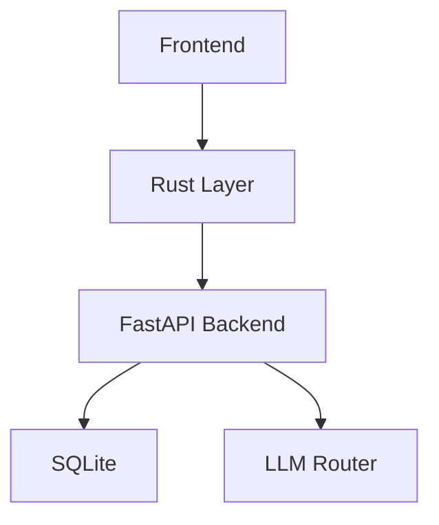

# Plobi Workflow

> Human Sovereignty, AI Execution. Physical Documents Against Hallucination.

---

## Role Contract

| Role | Responsibility | Input | Output |
|------|---------------|-------|--------|
| **Operator** (You) | Strategic decisions | Ideas, choices, feedback | Vision, approval, rejection |
| **AI** | Tactical execution | Operator input + documents | Code, tests, docs, updates |

**You never need to:** write code, read tests, understand architecture, fix merge conflicts, or memorize skill names.

**You always need to:** describe what you want, choose between options AI presents, and say "pass" or "fix this" after seeing results.

---

## Document System

All documents are physical files. AI memory resets; documents persist.

### `.docs/` — Operator View (Human-Readable)

| Document | Purpose | Written By | Read By |
|----------|---------|------------|---------|
| `PROJECT.md` | Vision, shipped features, backlog, recent changes | AI | You |
| `PROGRESS.md` | Current task status, blockers, next steps | AI (auto-update) | You |
| `ARCHITECTURE.md` | Module map + Mermaid diagrams | AI | You + AI |
| `DESIGN.md` | UI style, colors, interactions, component rules | AI | You + AI |

**Naming rule:** ALL_CAPS, underscores. `.docs/` sorts to the top of file listings.

### `.ai/` — Execution Context (AI-Readable)

| Document | Purpose | Written By |
|----------|---------|------------|
| `.ai/CONTEXT.md` | Glossary, API contracts, data models, SSE event types | AI (grill) |
| `.ai/DECISIONS/ADR-XXX.md` | Every major decision: what, why, what was rejected | AI (grill) |
| `.ai/DECISIONS/VETO-XXX.md` | Permanently rejected decisions | AI (grill) |
| `.ai/TESTS/STRATEGY.md` | Test pyramid, coverage targets, mock boundaries | AI |
| `.ai/TESTS/COVERAGE.md` | Current coverage per module, gap list | AI (auto-update) |
| `.ai/DEBT.md` | Legacy markers, known rot, refactoring queue | AI (fuse) |
| `SESSION.md` | Last session summary + next starting point | AI (auto-update) |

**Freeze line (iron rule):**
- Content confirmed and written into `.ai/CONTEXT.md` enters **frozen state**
- Can only **append**, never **modify** existing entries
- If change needed: mini-grill + ADR explaining why
- **Errata lane:** Typos, broken links, outdated references may be fixed without ADR. Log the change in `SESSION.md`.
- AI has no authority to override frozen content

---

## Skills Overview

Skills are AI capabilities. You do not invoke them directly — AI selects the appropriate skill based on context.

| Skill | Duty | When Used |
|-------|------|-----------|
| **guard** | Block dangerous git operations (push, reset --hard, clean, branch -D) | Every session start |
| **scaffold** | Create `.docs/` + `.ai/` + folder structure | Project init |
| **explore** | Ask questions, recommend missing features | You say "I have an idea" |
| **recon** | Research tech/competitors, write to `.ai/RESEARCH.md` | You say "Research X" |
| **grill** | Relentless interrogation until shared understanding | Before any design lock |
| **design** | Write `.docs/DESIGN.md` (UI spec) | After requirements confirmed |
| **synthesize** | Generate `PROJECT.md` from confirmed context | After grill |
| **slice** | Break `PROJECT.md` into vertical slice tasks | After PRD confirmed |
| **freeze** | TDD for **new** code: fail test → minimal pass → next | New slice development |
| **thaw** | Characterization test for **existing** code: lock behavior → mark legacy → plan replacement | Legacy code onboarding |
| **fuse** | Architecture scan: find rot, propose fixes, write `DEBT.md` | Milestone or manual trigger |
| **dissect** | Bug diagnosis: reproduce → minimise → fix → regression | Bug reports |
| **package** | Generate `.ai/SESSION.md` for handoff | Session end |
| **resume** | New session init: read SESSION.md + templates, generate opening | Session start |
| **tidy** | Enforce naming conventions, directory hygiene | On request |
| **compress** | Ultra-terse communication mode, reduce token usage | Long sessions or context pressure |
| **map** | Codebase module mapping scan | When understanding overall architecture |
| **forge** | Create new skills | When the workflow itself needs extension |

**18 skills total.**

---

## Session Management

> **One window, one thing.** Different task types get different session windows. Context isolation is the foundation of engineering efficiency.

### Why You Must Split Sessions

AI suffers from **Context Rot**: the longer the conversation, the weaker its grasp of the original goal, and the more likely it is to fall into "fix loops." Research shows that bug fixing and feature development have fundamentally different interaction patterns — mixing them accelerates context degradation.

| Single Window | Multiple Windows |
|---------------|------------------|
| Write feature → hit error → fix environment → AI forgets original goal | Feature window stays clear; environment issues get their own window |
| 10 rounds without resolution, AI starts cycling suggestions | New window resets attention; re-describe the problem |
| Code, config, and requirements jumbled together | Each problem type has its own context space |

### Session Type Definitions

| Type | Purpose | Forbidden | Opening Requirements |
|------|---------|-----------|---------------------|
| **Feature Session** | Write new features, design, implement slices | Do not fix environments or debug errors here | Project background + current phase + acceptance criteria |
| **Explore Session** | Read code, research tech, understand architecture | Do not write code here | Question + scope + relevant file paths |
| **Debug Session** | Fix bugs, diagnose errors | Do not add new requirements here | Full error + attempted solutions + system info |
| **Environment Session** | Install dependencies, configure environment, fix toolchain | Do not write business logic here | OS / language version / project path + full error |
| **Review Session** | Code review, acceptance testing | Do not change implementation here | Change summary + focus areas + reference docs |
| **Meta Session** | Use a sandbox project to refine the workflow itself (e.g. developing Helm while using Vaelis as testbed) | Do not use for product development; only for workflow meta-iteration | Workflow goal + sandbox project name + feedback loop being observed |

> **Meta Session is a special exception.** Normal projects must follow "one window, one thing." But when developing the workflow itself, mixed context becomes an asset — you need to see the full Feature / Debug / Cleanup feedback loop in one window to refine the workflow.
>
> **Meta Session characteristics:**
>
> - Allows mixing multiple task types in one window
> - `/plobi-package` must archive by project (which artifacts belong to meta-workflow vs. sandbox project)
> - Restricted to "developing workflow tools themselves" — not for product work

### Session Split Red Lines (Open a new window immediately when you see these)

1. **Topic changed** — from "write feature" to "fix environment", from "develop" to "research"
2. **More than 10 rounds without resolution** — context is polluted, AI is looping
3. **AI repeats already-tried solutions** — it is "looping," not "thinking"
4. **Need to overturn previous architecture decisions** — new window for clean realignment, not "undo" in current window
5. **Switching from coding to planning/design** — design needs tree exploration; coding needs linear progression

### Opening Templates (Mandatory for new windows)

Never just say "continue." The first sentence of a new window determines the entire conversation quality.

**Feature Session:**

```
I am the developer of [project name]. Current need: [one sentence].

Project background:
- Tech stack: [e.g., Tauri + React + FastAPI]
- Current phase: [e.g., Slice 3 complete, entering Slice 4]
- Relevant docs: [e.g., .ai/CONTEXT.md section X]

Please help me implement: [specific task]
Requirements:
1. [Acceptance criterion 1]
2. [Acceptance criterion 2]
3. Do not modify unrelated files
```

**Debug Session:**

```
I am the developer of [project name], encountering an error in [module/feature].

System info:
- OS: [Windows 11 / macOS / Linux]
- Language/tool version: [Python 3.11 / Node 20]
- Project path: [/path/to/project]

Problem:
[Full error message, copy-paste]

I have tried:
1. [Solution 1] → [Result]
2. [Solution 2] → [Result]

Please help me diagnose the root cause and provide specific fix commands.
```

**Explore Session:**

```
I want to understand how [module] works in [project name].

Scope: Focus on [A] to [B], exclude [C]
Relevant files: [file paths]

Please help me analyze: [specific question]
Output format: [list / flowchart / comparison table]
```

### Shortcut Commands (Minimal Mode)

If you don't want to manually assemble opening messages, place `.ai/SESSION_TEMPLATES.md` in the project root. The AI reads it automatically and fills in the blanks.

| You say | AI auto-does |
|---------|-------------|
| "Open Feature Session" or "I want to build X" | Reads template + SESSION.md/PROJECT.md, assembles opening for your confirmation |
| "Fix environment" / "conda broken" / "install deps" | Reads Environment template + detects system info, waits for your error paste |
| "Look at this bug" / "Got an error" | Reads Debug template + recent changes, waits for your error paste |
| "Explain X module" / "How does this work" | Reads Explore template + finds relevant files, waits for scope confirmation |
| "Review this code" | Reads Review template + DESIGN.md, waits for your change summary |

**How it works:** The template file uses `{{variables}}` for auto-filled fields (project name, tech stack, current phase, etc.). You only need to supply 1-2 sentences.

> **Note:** Even with shortcuts, you must glance at the assembled opening to verify key facts. This is the final quality gate.

### Cross-Window Handoff (Two Commands)

**Goal: Hand off with two commands. No manual copy-paste.**

**Before ending current window, type `/package`:**

AI automatically:

1. Reads current project state (git status, changed files, recent commits)
2. Reads existing `.ai/SESSION.md` (if any)
3. Writes updated `.ai/SESSION.md`:
   - What was completed this session
   - Unresolved blockers
   - Next session starting point (what to do, which session type)
4. Tells you: "Session packaged. Open new window and type `/resume` to continue."

**After starting new window, type `/resume`:**

AI automatically:

1. Reads `.ai/SESSION.md` → `.ai/SESSION_TEMPLATES.md` → `.ai/CONTEXT.md` → `.docs/PROJECT.md`
2. Selects template based on "next session type" recorded in SESSION.md
3. Auto-fills variables (project name, tech stack, current phase, blockers)
4. Generates a complete opening message for your confirmation
5. Proceeds directly to execution after confirmation

> **Anti-pattern:** In a new window, only saying "continue" — AI has no memory; it will guess.
> **Correct:** `/resume` rebuilds context from physical documents, not conversation history.

---

## Phase 0 — Init

**You do:** Answer scaffold's three questions. Nothing else.

**Execution order (sequential, no skipping):**

```
Step 1 → guard    (install git locks)
Step 2 → scaffold (create .docs/ + .ai/ + folders)
Step 3 → compress (enable caveman mode for AI execution)
```

### Guard
Installs OS-level interception of dangerous git commands. Your own `git push` is unaffected.

Blocked commands: `git push`, `git reset --hard`, `git clean -fd`, `git branch -D`, `git checkout .`, `git restore .`

### Scaffold
Auto-creates:

```
your-project/
├── .docs/
│   ├── PROJECT.md
│   ├── PROGRESS.md
│   ├── ARCHITECTURE.md
│   └── DESIGN.md
├── .ai/
│   ├── CONTEXT.md
│   ├── DECISIONS/
│   ├── TESTS/
│   ├── DEBT.md
│   └── SESSION.md
└── src/ or backend/ or app/
```

### Scaffold's Three Questions

1. Which issue tracker? (GitHub Issues / Notion / Local markdown)
2. Project codename? (For ADR prefix, e.g. `TASK-001`)
3. Preferred language? (中文 / English — for documentation)

> **Iron rule:** No requirements discussion before Phase 0 completes. Locks and skeleton must be in place first.

---

## Phase 1 — Design

**You do:** Describe your idea in natural language. Answer AI clarification questions. Make choices.

**Internal flow (AI executes, you observe):**

```
explore (divergent questions) →
recon (if new tech area) →
grill (convergent interrogation) →
synthesize (write PROJECT.md)
```

### What You See
AI asks you questions like:
- "You said 'smooth' — do you mean 60fps animation or instant response?"
- "What if the user uploads a 100MB file?"
- "Should deleted items be recoverable?"

**You answer in plain language.** No technical knowledge needed.

### What Gets Written
After grill converges, AI writes:
- `.docs/PROJECT.md` — Feature list, priorities, acceptance criteria
- `.ai/CONTEXT.md` — Aligned definitions, API contracts, data models
- `.ai/DECISIONS/ADR-XXX.md` — Every major decision and rejected alternative

> **Freeze line:** Content in `.ai/CONTEXT.md` and `.docs/PROJECT.md` is frozen after your "yes". AI cannot modify without mini-grill + ADR.

---

## Phase 2 — Plan

**You do:** Review the slice list. Confirm order. Say "yes" or "move X before Y".

**Internal flow:**

```
design (UI/UX spec) → slice (vertical breakdown) → grill (stress-test)
```

### Vertical Slice Definition
Each slice = one **end-to-end demoable feature**.

**Correct:** "User can create a Todo" (includes database + API + UI + tests)
**Incorrect:** "Build all database tables" (horizontal layer, not slice)

**Exception — Infrastructure Slice:**
Pure scaffolding work ("Setup Tailwind", "Configure Tauri") may be bundled as **Phase 0.5 Infrastructure Slices**. These are not end-to-end features, but they unblock all subsequent slices. Maximum 2-3 per project.

### What Gets Written
- `.docs/PROGRESS.md` — Slice table with status
- `.ai/TESTS/STRATEGY.md` — Test approach per slice

> **Interface contract lock:** Phase 2 ends with frozen slice descriptions + acceptance criteria. Phase 3 AI can only implement, cannot change feature definitions.

---

## Phase 3 — Develop

**You do:** Check `.docs/PROGRESS.md` for status. Respond to HITL pauses. Do functional acceptance.

**Internal flow (AI executes):**

```
For each slice:
  If new code → freeze (TDD loop)
  If legacy code → thaw (characterization test + isolation)
  Code review gate (auto)
  Functional acceptance checklist (you)
```

### AFK Slice (AI Autonomous)
AI runs the full TDD cycle without interrupting you:

```
freeze →
  RED: Write failing test (prove feature not implemented)
  GREEN: Write minimal code to pass
  Next behavior → Repeat
```

You do not see this loop. Its purpose: AI has verifiable signal at every step.

### Legacy Slice (Thaw, Not Freeze)
When modifying existing untested code:

```
thaw →
  1. Write characterization test (lock current behavior, even if wrong)
  2. If module quality < threshold: mark LEGACY in DEBT.md, isolate
  3. New slices may NOT depend on LEGACY modules
  4. Replacement slice planned for later
```

> **Iron rule:** Un-testable code cannot enter freeze. If fuse scan flags a module as "un-testable", it must be thawed + isolated before any slice touches it.

### HITL Slice (Pause for You)
When AI needs your decision:
1. Pause, mark "waiting for decision" in `.docs/PROGRESS.md`
2. Ask in plain language (e.g., "Can all users delete others' Todos, or only the creator?")
3. Your answer → AI writes ADR → continues coding

### Code Review Gate (Per Slice)

**Layer 1 (auto, no action needed):**
AI scanner checks: hardcoded passwords, accidentally deleted files, spec violations. Auto-fixes if found.

**Layer 2 (you do, no code needed):**
AI gives functional acceptance checklist:

```
Slice #2 complete. Please verify:
□ Click "Delete" button → Todo disappears from list
□ After delete, page does not refresh or error
□ If Todo doesn't exist, show friendly error

Type "pass" to continue, or describe what went wrong.
```

**Simple features:** Use checklist (you click through, reply pass/fail).
**Complex UI changes:** Screenshot the result, AI compares against DESIGN.md.

> **Bug escalation rule:**
> - Small reproducible bug: AI fixes immediately
> - Unstable or unclear bug: mandatory Phase 5 diagnosis, no guessing allowed

---

## Phase 4 — Extend

**You do:** Same as Phase 1 — describe new features, answer questions, choose options.

### Extension Level System

Not all features need the full Phase 1-3 flow. Extensions are classified by impact:

| Level | Type | Examples | Your Input | Flow |
|-------|------|----------|------------|------|
| **L1** | Configuration | Add Agent, change model, toggle feature | One sentence | AI auto-executes |
| **L2** | Plugin | Install MCP tool, add integration | One sentence | AI auto-executes |
| **L3** | Component | New preview type, new UI panel | One paragraph | Simplified design → slice → develop |
| **L4** | Core | New protocol, new architecture | Discussion | Full Phase 1-3 |

**L1/L2** skip explore/recon/grill. AI validates safety, executes, updates PROJECT.md.

**L3** runs mini-design (skip recon if domain known), then slice + develop.

**L4** runs full Phase 1-3.

> **Veto prevents re-litigation:** Before any L3/L4 design, AI checks `.ai/DECISIONS/VETO-*.md`. If your request resembles a vetoed decision, AI cites it and blocks. You can say "I want to reconsider" to reopen.

> **Regression rule:** After each extension slice completes, rerun all existing tests to confirm extension didn't break existing functionality.

---

## Phase 5 — Bug Fix

**You do:** Provide structured feedback. Supplement background knowledge.

### Feedback Format (Mandatory)

```
[Location] Which page/feature
[Action] What I did
[Expected] What I thought would happen
[Actual] What actually happened
[Impact] Severity (blocks usage / bad experience / minor detail)
```

**Example:**
```
[Location] Todo list page
[Action] Clicked "Delete" button
[Expected] Todo disappears, list updates
[Actual] Todo disappeared, but page blanked for one second
[Impact] Bad experience
```

**Why format matters:** Structured feedback lets AI modify only relevant code, drastically reducing "fix one, break two" risk.

### Dissect 6 Phases

| Phase | AI Doing | You Doing |
|-------|----------|-----------|
| ① Build feedback loop | Write stable repro test | If AI says "can't reproduce", give more detailed steps |
| ② Minimize repro | Reduce to simplest path | — |
| ③ Hypothesize | List 3-5 possible causes, ranked | Reorder based on your background knowledge |
| ④ Single-variable verify | Change one thing at a time, observe | — |
| ⑤ Fix + regression | Fix, test turns green, write regression test | Confirm with format again |
| ⑥ Post-mortem | Write root cause in commit message | — |

> **Iron rule:** AI must not "read code and guess". If AI says "I think it's XXX" without first writing a repro test, stop it and make it complete Phase ① first.

---

## Phase 6 — Optimize (Auto-Triggered)

**You do:** Nothing, unless AI requests manual approval.

### Three Auto-Triggers

| Trigger | Condition | AI Action |
|---------|-----------|-----------|
| **Milestone** | All slices in a phase complete | Run fuse (architecture scan), write DEBT.md |
| **Threshold** | 5+ implemented features you haven't accepted | Halt new features, clear backlog first |
| **Legacy Drift** | New slice depends on LEGACY module | Block + propose replacement slice |

This phase runs automatically. You are only notified if fuse finds critical rot or if the threshold halts development.

---

## Cross-Session Protocol

Frequent session switches risk context loss. Physical documents prevent fracture.

### Before Session End

```
1. Type /package → AI reads state, writes .ai/SESSION.md
2. Confirm SESSION.md written (physical file exists)
3. Commit a WIP commit (even if code incomplete)
```

### After Session Start

```
1. Type /resume → AI reads .ai/SESSION.md → SESSION_TEMPLATES.md → CONTEXT.md → PROJECT.md
2. Generates opening based on "next session type" in SESSION.md
3. Confirm opening, add 1-2 sentences
4. Continue from "Next slice" in PROGRESS.md
5. Do not re-discuss frozen decisions
```

> **Iron rule:** New session AI must not rely on its own "memory". All context must come from physical documents.

---

## Seven Iron Rules (Quick Reference)

Stop AI immediately when you see:

| # | Iron Rule | Signal to Stop |
|---|-----------|----------------|
| 1 | **No feedback loop, no progress** | AI says "I think it's..." without writing a test to verify |
| 2 | **Tests first, always** | AI says "I'll write code first, tests later" |
| 3 | **You define features, AI writes implementation** | AI says "This feature should change to..." without your approval |
| 4 | **Vertical slices, reject horizontal layers** | AI says "I'll build all database tables first" |
| 5 | **Freeze line** | AI modifies `.docs/PROJECT.md` or `.ai/CONTEXT.md` feature definitions on its own |
| 6 | **Veto prevents re-litigation** | AI re-discusses already-rejected solution |
| 7 | **Physical interception of dangerous ops** | AI attempts git push / reset --hard |

---

## Complete Flow Overview

```
Phase 0  Init
  guard → scaffold → compress
  Output: .docs/ + .ai/ + folder skeleton in place

Phase 1  Design
  explore → recon → grill → synthesize
  Output: .docs/PROJECT.md + .ai/CONTEXT.md + ADR

Phase 2  Plan
  design (UI) → slice (breakdown) → grill (stress-test)
  Output: .docs/DESIGN.md + .docs/PROGRESS.md + TESTS/STRATEGY.md

Phase 3  Develop
  freeze (new code, TDD) / thaw (legacy code, isolation)
  Output: Working slice + updated PROGRESS.md

Phase 4  Extend
  L1/L2 auto → L3 mini-design → L4 full Phase 1-3
  Output: Extended functionality + regression verification

Phase 5  Fix
  dissect 6 phases → fix → regression verify
  Output: Stable bug fix

Phase 6  Optimize
  fuse (architecture scan) → DEBT.md update
  Output: Technical debt catalog + replacement plan
```

---

## Appendix: Document Templates

### PROJECT.md Template

```markdown
# {Project Name}

## Vision
One sentence describing what this product is and who it's for.

## Shipped Features
| # | Feature | Slice | Status |
|---|---------|-------|--------|
| 1 | User can create Todo | #1 | Done |

## Backlog
| Priority | Feature | Level | Notes |
|----------|---------|-------|-------|
| P1 | Dark mode toggle | L3 | Waiting for Phase 2 |

## Recent Changes
| Date | Change | Slice |
|------|--------|-------|
| 2026-05-20 | Added pulse indicator while waiting for first token | #4 |

## Glossary
| Term | Definition |
|------|------------|
| {Term} | {Plain-language definition} |
```

### PROGRESS.md Template

```markdown
# Progress

## Current Sprint
| Slice | Description | Status | Type | Notes |
|-------|-------------|--------|------|-------|
| #5 | User can edit Todo | In Progress | AFK | |
| #6 | Multi-user permissions | Waiting for you | HITL | Who can edit? |

## Completed This Session
Started: ... | Completed: #3, #4 | Next: #5

## Blockers
- None / {Description}
```

### ARCHITECTURE.md Template

```markdown
# Architecture

## Module Map



## Module Depth Rating
| Module | Interface | Complexity | Rating |
|--------|-----------|------------|--------|
| memory/db.py | get_db() | Connection pool | Deep |
| main.py | HTTP endpoints | 200+ lines god function | Shallow |

## Extension Points
| Point | How to Extend | Example |
|-------|---------------|---------|
| New Agent | Add JSON config to agents_config/ | "Add financial advisor" |
| New Preview | Add component to components/preview/ | "Add mind map preview" |
```

### SESSION.md Template

```markdown
# Session Summary

## Completed
- Slices: #1, #2
- Decisions: [ADR-003] Chose soft delete over hard delete

## Open Issues
- Slice #3 waiting for operator decision

## Next Session Starting Point
- Next slice: #3
- Need your decision: Can all users delete others' Todos?
- Related docs: .ai/CONTEXT.md section 3
```

---

*Plobi Engineering Sovereignty Manual · Human Sovereignty, AI Execution, Physical Documents Against Hallucination.*
