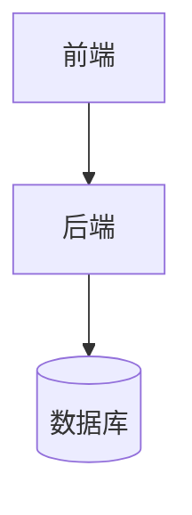

# Plobi 工作流

> 人类主权，AI 执行。物理文档对抗幻觉。

---

## 角色契约

| 角色 | 职责 | 输入 | 输出 |
|------|------|------|------|
| **操作者**（你） | 战略决策 | 想法、选择、反馈 | 愿景、批准、拒绝 |
| **AI** | 战术执行 | 操作者输入 + 文档 | 代码、测试、文档、更新 |

**你不需要：**写代码、读测试、理解架构、解决合并冲突、或记忆技能名称。

**你必须：**描述你想要什么，在 AI 呈现的选项之间做选择，在看到结果后说"通过"或"修复这个"。

---

## 文档系统

所有文档都是物理文件。AI 记忆会重置；文档永存。

### `.docs/` — 操作者视图（人类可读）

| 文档 | 用途 | 撰写者 | 读者 |
|------|------|--------|------|
| `PROJECT.md` | 愿景、已交付功能、待办事项、近期变更 | AI | 你 |
| `PROGRESS.md` | 当前任务状态、阻塞项、下一步 | AI（自动更新） | 你 |
| `ARCHITECTURE.md` | 模块地图 + Mermaid 图表 | AI | 你 + AI |
| `DESIGN.md` | UI 风格、颜色、交互、组件规则 | AI | 你 + AI |

**命名规则：**全大写，下划线。`.docs/` 在文件列表中排序置顶。

### `.ai/` — 执行上下文（AI 可读）

| 文档 | 用途 | 撰写者 |
|------|------|--------|
| `.ai/CONTEXT.md` | 术语表、API 契约、数据模型、SSE 事件类型 | AI（grill） |
| `.ai/DECISIONS/ADR-XXX.md` | 每个重大决策：做了什么、为什么、拒绝了什么 | AI（grill） |
| `.ai/DECISIONS/VETO-XXX.md` | 永久拒绝的决策 | AI（grill） |
| `.ai/TESTS/STRATEGY.md` | 测试金字塔、覆盖率目标、Mock 边界 | AI |
| `.ai/TESTS/COVERAGE.md` | 每个模块的当前覆盖率、缺口列表 | AI（自动更新） |
| `.ai/DEBT.md` | 遗留标记、已知腐烂、重构队列 | AI（fuse） |
| `SESSION.md` | 上次会话摘要 + 下次起点 | AI（自动更新） |

**冻结线（铁律）：**
- 确认并写入 `.ai/CONTEXT.md` 的内容进入**冻结状态**
- 只能**追加**，永远**不修改**现有条目
- 如需更改：mini-grill + ADR 解释原因
- **勘误通道：**错别字、断链、过期引用可直接修复，无需 ADR。在 `SESSION.md` 中记录变更。
- AI 无权覆盖冻结内容

---

## 技能概览

技能是 AI 的能力。你不需要直接调用它们 —— AI 根据上下文选择合适的技能。

| 技能 | 职责 | 使用时机 |
|------|------|----------|
| **guard** | 阻止危险的 git 操作（push、reset --hard、clean、branch -D） | 每次会话开始 |
| **scaffold** | 创建 `.docs/` + `.ai/` + 文件夹结构 | 项目初始化 |
| **explore** | 提问、推荐遗漏的功能 | 你说"我有个想法" |
| **recon** | 研究技术/竞品，写入 `.ai/RESEARCH.md` | 你说"研究一下 X" |
| **grill** | 无情审问直到达成共识 | 任何设计锁定之前 |
| **design** | 撰写 `.docs/DESIGN.md`（UI 规范） | 需求确认后 |
| **synthesize** | 从确认上下文生成 `PROJECT.md` | grill 之后 |
| **slice** | 将 `PROJECT.md` 拆分为垂直切片任务 | PRD 确认后 |
| **freeze** | **新代码**的 TDD：失败测试 → 最小通过 → 下一个 | 新切片开发 |
| **thaw** | **现有代码**的特征化测试：锁定行为 → 标记遗留 → 计划替换 | 遗留代码接入 |
| **fuse** | 架构扫描：发现腐烂、提出修复、写入 `DEBT.md` | 里程碑或手动触发 |
| **dissect** | Bug 诊断：复现 → 最小化 → 修复 → 回归 | Bug 报告 |
| **package** | 生成 `.ai/SESSION.md` 用于交接 | 会话结束 |
| **resume** | 新会话初始化：读 SESSION.md + 模板，生成开场白 | 会话开始 |
| **tidy** | 强制执行命名规范、目录卫生 | 按需 |
| **compress** | 极简通信模式，减少 Token 消耗 | 长会话或上下文紧张时 |
| **map** | 代码库模块地图扫描 | 需要理解整体架构时 |
| **forge** | 创建新技能 | 工作流本身需要扩展时 |

**共 18 个技能。**

---

## 会话管理

> **一窗一事。** 不同类型的任务用不同的会话窗口。上下文隔离是工程效率的基石。

### 为什么必须分窗

AI 存在 **Context Rot（上下文腐烂）**：对话越长，对原始目标的理解越弱，越容易陷入"循环修复"。研究表明，bug fixing 和 feature development 的交互模式完全不同，混在一起会加速上下文退化。

| 单窗口 | 多窗口 |
|--------|--------|
| 写功能 → 报错 → 修环境 → AI 忘了最初目标 | 功能窗口保持清晰，环境问题另开窗口修 |
| 10 轮没修好，AI 开始循环建议 | 新开窗口重置注意力，重新描述问题 |
| 代码、配置、需求混在一起 | 每类问题有独立的上下文空间 |

### 会话类型定义

| 类型 | 用途 | 禁忌 | 开场白要求 |
|------|------|------|-----------|
| **Feature Session** | 写新功能、做设计、实现切片 | 不要在这里修环境、查报错 | 带项目背景 + 当前阶段 + 验收标准 |
| **Explore Session** | 读代码、调研技术、理解架构 | 不要在这里写代码 | 带问题 + 范围 + 相关文件路径 |
| **Debug Session** | 修 Bug、诊断报错 | 不要在这里加新需求 | 带完整报错 + 已尝试方案 + 系统信息 |
| **Environment Session** | 装依赖、配环境、修工具链 | 不要在这里写业务逻辑 | 带 OS / 语言版本 / 项目路径 + 报错全文 |
| **Review Session** | 代码审查、验收功能 | 不要在这里改实现 | 带改动摘要 + 关注点 + 参考文档 |
| **Meta Session** | 借试验项目完善工作流本身（如开发 Helm 时用 Vaelis 当试验场） | 不要用于产品开发；只用于工作流元层迭代 | 带工作流目标 + 试验项目名 + 当前要观察的反馈循环 |

> **Meta Session 是特殊例外。** 普通项目必须遵守"一窗一事"。但当开发的对象是工作流本身时，混合上下文反而是资产——你需要在同一窗口看到 Feature / Debug / Cleanup 的完整反馈循环，才能优化工作流。
>
> **Meta Session 的特点：**
>
> - 允许同窗混合多种任务类型
> - `/plobi-package` 时要分项目归档（哪些归元工作流、哪些归试验项目）
> - 仅限用于"开发工作流工具本身"，不用于做产品

### 切窗红线（出现以下情况，立即开新窗口）

1. **话题变了** — 从"写功能"变成"修环境"、从"开发"变成"调研"
2. **超过 10 轮还没解决** — 说明当前上下文已被污染，AI 在循环
3. **AI 开始反复提出已试过的方案** — 它在"循环"，不是"思考"
4. **需要推翻之前的架构决定** — 新窗口重新对齐，比在当前窗口"撤回"更干净
5. **从 coding 切换到规划设计** — 设计需要树状探索，编码需要线性推进

### 开场白模板（新窗口必备）

不要只说"继续"。新窗口的第一句话决定整个对话质量。

**Feature Session：**

```
我是 [项目名] 的开发者。当前需求是：[一句话]。

项目背景：
- 技术栈：[例如 Tauri + React + FastAPI]
- 当前阶段：[例如 Slice 3 已完成，进入 Slice 4]
- 相关文档：[例如 .ai/CONTEXT.md 第 X 节]

请帮我实现：[具体任务]
要求：
1. [验收标准 1]
2. [验收标准 2]
3. 不要修改无关文件
```

**Debug Session：**

```
我是 [项目名] 的开发者，遇到 [模块/功能] 的报错。

系统信息：
- OS：[Windows 11 / macOS / Linux]
- 语言/工具版本：[Python 3.11 / Node 20]
- 项目路径：[D:\Projects\...]

问题现象：
[完整报错信息，复制粘贴]

我已尝试：
1. [方案 1] → [结果]
2. [方案 2] → [结果]

请帮我诊断根因，给出明确的修复命令。
```

**Explore Session：**

```
我想理解 [项目名] 中 [模块] 的工作原理。

范围：只关注 [A] 到 [B]，不涉及 [C]
相关文件：[文件路径]

请帮我梳理：[具体问题]
输出格式：[列表 / 流程图 / 对比表]
```

### 快捷指令（极简模式）

如果你不想手动拼接开场白，项目根目录放一份 `.ai/SESSION_TEMPLATES.md`，AI 会自动读取并填充。

| 你说 | AI 自动做 |
|------|----------|
| "开 Feature Session" 或 "我要做 X 功能" | 读模板 + 读 SESSION.md/PROJECT.md，拼好开场白等你确认 |
| "修环境" / "conda 坏了" / "装依赖" | 读 Environment 模板 + 检测系统信息，等你贴报错 |
| "看这个 Bug" / "报错了" | 读 Debug 模板 + 读最近改动，等你贴报错 |
| "读一下 X 模块" / "这是怎么工作的" | 读 Explore 模板 + 找相关文件，等你确认范围 |
| "审一下这段代码" | 读 Review 模板 + 读 DESIGN.md，等你贴改动 |

**原理：** 模板文件里用 `{{变量}}` 标记了 AI 自动填充的字段（项目名、技术栈、当前阶段等），你只需要补 1-2 句话。

> **注意：** 即使使用快捷指令，你仍需看一眼拼好的开场白，确认关键信息没错。这是最后一道质量门。

### 跨窗接力（两个命令）

**目标：两个命令完成交接，无需手动复制。**

**当前窗口结束前，输入 `/package`：**

AI 自动：

1. 读取当前项目状态（git status、已改文件、最近提交）
2. 读取已有的 `.ai/SESSION.md`（如有）
3. 写入更新后的 `.ai/SESSION.md`：
   - 本次完成的内容
   - 未解决的阻塞项
   - 下次会话的起点（该做什么、用什么 session 类型）
4. 提示你："Session packaged. 新窗口输入 `/resume` 继续。"

**新窗口开始后，输入 `/resume`：**

AI 自动：

1. 读取 `.ai/SESSION.md` → `.ai/SESSION_TEMPLATES.md` → `.ai/CONTEXT.md` → `.docs/PROJECT.md`
2. 根据 SESSION.md 中记录的"下次会话类型"选择对应模板
3. 自动填充变量（项目名、技术栈、当前阶段、阻塞项等）
4. 生成完整的开场白，等你确认或补充 1-2 句话
5. 确认后直接开始执行

> **反模式：**在新窗口只说"继续"——AI 没有记忆，它只会瞎猜。
> **正确：**`/resume` 让 AI 从物理文档重建上下文，不是从对话历史。

---

## 阶段 0 — 初始化

**你做：**回答 scaffold 的三个问题。其他都是 AI 的事。

**执行顺序（顺序执行，不跳过）：**

```
步骤 1 → guard    （安装 git 锁）
步骤 2 → scaffold （创建 .docs/ + .ai/ + 文件夹）
步骤 3 → compress （启用 AI 执行的洞穴人模式）
```

### Guard
在操作系统层面拦截危险的 git 命令。你自己的 `git push` 不受影响。

拦截命令：`git push`、`git reset --hard`、`git clean -fd`、`git branch -D`、`git checkout .`、`git restore .`

### Scaffold
自动创建：

```
your-project/
├── .docs/
│   ├── PROJECT.md
│   ├── PROGRESS.md
│   ├── ARCHITECTURE.md
│   └── DESIGN.md
├── .ai/
│   ├── CONTEXT.md
│   ├── DECISIONS/
│   ├── TESTS/
│   ├── DEBT.md
│   └── SESSION.md
└── src/ 或 backend/ 或 app/
```

### Scaffold 的三个问题

1. 使用哪个问题追踪器？（GitHub Issues / Notion / 本地 markdown）
2. 项目代号？（用于 ADR 前缀，例如 `TASK-001`）
3. 首选语言？（中文 / English —— 用于文档）

> **铁律：**阶段 0 完成之前不讨论需求。锁和骨架必须先到位。

---

## 阶段 1 — 设计

**你做：**用自然语言描述你的想法。回答 AI 的澄清问题。做选择。

**内部流程（AI 执行，你观察）：**

```
explore（发散问题）→
recon（如果是新技术领域）→
grill（收敛审问）→
synthesize（撰写 PROJECT.md）
```

### 你会看到什么
AI 问你这样的问题：
- "你说'流畅'——是指 60fps 动画还是即时响应？"
- "如果用户上传了 100MB 的文件怎么办？"
- "删除的条目应该可恢复吗？"

**你用 plain language 回答。**不需要技术知识。

### 会写入什么
grill 收敛后，AI 写入：
- `.docs/PROJECT.md` —— 功能列表、优先级、验收标准
- `.ai/CONTEXT.md` —— 对齐的定义、API 契约、数据模型
- `.ai/DECISIONS/ADR-XXX.md` —— 每个重大决策和拒绝的替代方案

> **冻结线：**`.ai/CONTEXT.md` 和 `.docs/PROJECT.md` 中的内容在你的"是"之后冻结。AI 不能在没有 mini-grill + ADR 的情况下修改。

---

## 阶段 2 — 规划

**你做：**审查切片列表。确认顺序。说"是"或"把 X 移到 Y 前面"。

**内部流程：**

```
design（UI/UX 规范）→ slice（垂直拆分）→ grill（压力测试）
```

### 垂直切片定义
每个切片 = 一个**端到端可演示的功能**。

**正确：**"用户可以创建 Todo"（包含数据库 + API + UI + 测试）
**错误：**"建完所有数据库表"（水平层，不是切片）

**例外 —— 基础设施切片：**
纯脚手架工作（"配置 Tailwind"、"配置 Tauri"）可以作为**阶段 0.5 基础设施切片**打包。这些不是端到端功能，但它们解锁了后续切片。每个项目最多 2-3 个。

### 会写入什么
- `.docs/PROGRESS.md` —— 带状态的切片表
- `.ai/TESTS/STRATEGY.md` —— 每个切片的测试方法

> **接口契约锁定：**阶段 2 以冻结的切片描述 + 验收标准结束。阶段 3 的 AI 只能实现，不能更改功能定义。

---

## 阶段 3 — 开发

**你做：**检查 `.docs/PROGRESS.md` 的状态。响应 HITL 暂停。做功能验收。

**内部流程（AI 执行）：**

```
对每个切片：
  如果是新代码 → freeze（TDD 循环）
  如果是遗留代码 → thaw（特征化测试 + 隔离）
  代码审查门（自动）
  功能验收清单（你）
```

### AFK 切片（AI 自主）
AI 在不打扰你的情况下运行完整的 TDD 循环：

```
freeze →
  RED：写失败测试（证明功能未实现）
  GREEN：写最小代码通过
  下一个行为 → 重复
```

你看不到这个循环。它的目的：AI 在每一步都有可验证的信号。

### 遗留切片（Thaw，不是 Freeze）
修改现有无测试代码时：

```
thaw →
  1. 写特征化测试（锁定当前行为，即使行为是错误的）
  2. 如果模块质量 < 阈值：在 DEBT.md 中标记 LEGACY，隔离
  3. 新切片**不得**依赖 LEGACY 模块
  4. 替换切片稍后计划
```

> **铁律：**不可测试的代码不能进入 freeze。如果 fuse 扫描将模块标记为"不可测试"，任何切片接触它之前必须先 thaw + 隔离。

### HITL 切片（暂停等你）
当 AI 需要你的决策时：
1. 暂停，在 `.docs/PROGRESS.md` 中标记"等待决策"
2. 用 plain language 提问（例如："所有人都能删除别人的 Todo，还是只有创建者可以？"）
3. 你的回答 → AI 写 ADR → 继续编码

### 代码审查门（每个切片）

**第一层（自动，无需操作）：**
AI 扫描器检查：硬编码密码、意外删除的文件、规范违规。发现则自动修复。

**第二层（你做，不需要代码）：**
AI 提供功能验收清单：

```
切片 #2 完成。请验证：
□ 点击"删除"按钮 → Todo 从列表消失
□ 删除后页面不刷新也不报错
□ 如果 Todo 不存在，显示友好错误

输入"pass"继续，或描述哪里不对。
```

**简单功能：**使用清单（你点一遍，回复 pass/fail）。
**复杂 UI 变更：**截图结果，AI 对比 DESIGN.md。

> **Bug 升级规则：**
> - 小的可复现 Bug：AI 立即修复
> - 不稳定或不清楚的 Bug：强制进入阶段 5 诊断，不允许猜测

---

## 阶段 4 — 扩展

**你做：**和阶段 1 一样 —— 描述新功能、回答问题、选择选项。

### 扩展分级系统

不是所有功能都需要完整的阶段 1-3 流程。扩展按影响分类：

| 级别 | 类型 | 示例 | 你的输入 | 流程 |
|------|------|------|----------|------|
| **L1** | 配置 | 添加 Agent、更改模型、切换功能 | 一句话 | AI 自动执行 |
| **L2** | 插件 | 安装 MCP 工具、添加集成 | 一句话 | AI 自动执行 |
| **L3** | 组件 | 新预览类型、新 UI 面板 | 一段话 | 简化设计 → 切片 → 开发 |
| **L4** | 核心 | 新协议、新架构 | 讨论 | 完整阶段 1-3 |

**L1/L2** 跳过 explore/recon/grill。AI 验证安全性、执行、更新 PROJECT.md。

**L3** 运行 mini-design（如果领域已知则跳过 recon），然后 slice + develop。

**L4** 运行完整阶段 1-3。

> **Veto 防止重复诉讼：**任何 L3/L4 设计之前，AI 检查 `.ai/DECISIONS/VETO-*.md`。如果你的请求类似于已否决的决策，AI 引用它并阻止。你可以说"我想重新考虑"来重新打开。

> **回归规则：**每个扩展切片完成后，重新运行所有现有测试以确认扩展没有破坏现有功能。

---

## 阶段 5 — Bug 修复

**你做：**提供结构化反馈。补充 AI 没有的背景知识。

### 反馈格式（强制）

```
[位置] 哪个页面/功能
[操作] 我做了什么
[预期] 我以为会发生什么
[实际] 实际发生了什么
[影响] 严重程度（阻断使用 / 体验糟糕 / 轻微细节）
```

**示例：**
```
[位置] Todo 列表页
[操作] 点击"删除"按钮
[预期] Todo 消失，列表更新
[实际] Todo 消失了，但页面空白了一秒钟
[影响] 体验糟糕
```

**为什么格式很重要：**结构化反馈让 AI 只修改相关代码，大幅减少"修一个坏两个"的风险。

### Dissect 六阶段

| 阶段 | AI 做什么 | 你做什么 |
|------|----------|----------|
| ① 建立反馈循环 | 写稳定复现测试 | 如果 AI 说"无法复现"，给更详细的步骤 |
| ② 最小化复现 | 简化为最短路径 | — |
| ③ 假设 | 列出 3-5 个可能原因，排序 | 根据你的背景知识重新排序 |
| ④ 单变量验证 | 一次改一个东西，观察 | — |
| ⑤ 修复 + 回归 | 修复，测试变绿，写回归测试 | 用格式再次确认 |
| ⑥ 事后分析 | 在提交信息中写根因 | — |

> **铁律：**AI 不能"读代码然后猜"。如果 AI 说"我觉得是 XXX"而没有先写复现测试，阻止它，让它先完成阶段 ①。

---

## 阶段 6 — 优化（自动触发）

**你做：**什么都不做，除非 AI 请求手动批准。

### 三个自动触发器

| 触发器 | 条件 | AI 动作 |
|--------|------|---------|
| **里程碑** | 一个阶段的所有切片完成 | 运行 fuse（架构扫描），写 DEBT.md |
| **阈值** | 5+ 已实现功能你未验收 | 暂停新功能，先清理积压 |
| **遗留漂移** | 新切片依赖 LEGACY 模块 | 阻止 + 提出替换切片 |

这个阶段自动运行。只有 fuse 发现关键腐烂或阈值暂停开发时才会通知你。

---

## 跨会话协议

频繁切换会话有上下文丢失风险。物理文档防止断裂。

### 会话结束前

```
1. 输入 /package → AI 读取状态，写入 .ai/SESSION.md
2. 确认 SESSION.md 已写入（物理文件存在）
3. 提交一个 WIP commit（即使代码不完整）
```

### 会话开始后

```
1. 输入 /resume → AI 读取 .ai/SESSION.md → SESSION_TEMPLATES.md → CONTEXT.md → PROJECT.md
2. 根据 SESSION.md 中的"下次会话类型"生成开场白
3. 确认开场白，补充 1-2 句话
4. 从 PROGRESS.md 中的"下一个切片"继续
5. 不重新讨论已冻结的决策
```

> **铁律：**新会话的 AI 不能依赖自己的"记忆"。所有上下文必须来自物理文档。

---

## 七条铁律（快速参考）

看到以下情况立即阻止 AI：

| # | 铁律 | 停止信号 |
|---|------|----------|
| 1 | **没有反馈循环，就没有进展** | AI 说"我觉得是..."但没有写测试验证 |
| 2 | **测试优先，永远** | AI 说"我先写代码，测试稍后" |
| 3 | **你定义功能，AI 写实现** | AI 说"这个功能应该改成..."而未经你批准 |
| 4 | **垂直切片，拒绝水平层** | AI 说"我先建完所有数据库表" |
| 5 | **冻结线** | AI 擅自修改 `.docs/PROJECT.md` 或 `.ai/CONTEXT.md` 的功能定义 |
| 6 | **Veto 防止重复诉讼** | AI 重新讨论已拒绝的方案 |
| 7 | **物理拦截危险操作** | AI 尝试 git push / reset --hard |

---

## 完整流程概览

```
阶段 0  初始化
  guard → scaffold → compress
  输出：.docs/ + .ai/ + 文件夹骨架就位

阶段 1  设计
  explore → recon → grill → synthesize
  输出：.docs/PROJECT.md + .ai/CONTEXT.md + ADR

阶段 2  规划
  design（UI）→ slice（拆分）→ grill（压力测试）
  输出：.docs/DESIGN.md + .docs/PROGRESS.md + TESTS/STRATEGY.md

阶段 3  开发
  freeze（新代码，TDD）/ thaw（遗留代码，隔离）
  输出：工作切片 + 更新的 PROGRESS.md

阶段 4  扩展
  L1/L2 自动 → L3 mini-design → L4 完整阶段 1-3
  输出：扩展功能 + 回归验证

阶段 5  修复
  dissect 六阶段 → 修复 → 回归验证
  输出：稳定的 Bug 修复

阶段 6  优化
  fuse（架构扫描）→ DEBT.md 更新
  输出：技术债务目录 + 替换计划
```

---

## 附录：文档模板

### PROJECT.md 模板

```markdown
# {项目名称}

## 愿景
一句话描述这个产品是什么、为谁而做。

## 已交付功能
| # | 功能 | 切片 | 状态 |
|---|------|------|------|
| 1 | 用户可以创建 Todo | #1 | 完成 |

## 待办事项
| 优先级 | 功能 | 级别 | 备注 |
|--------|------|------|------|
| P1 | 深色模式切换 | L3 | 等待阶段 2 |

## 近期变更
| 日期 | 变更 | 切片 |
|------|------|------|
| 2026-05-20 | 添加了首字等待时的脉冲指示器 | #4 |

## 术语表
| 术语 | 定义 |
|------|------|
| {术语} | {通俗定义} |
```

### PROGRESS.md 模板

```markdown
# 进度

## 当前冲刺
| 切片 | 描述 | 状态 | 类型 | 备注 |
|------|------|------|------|------|
| #5 | 用户可以编辑 Todo | 进行中 | AFK | |
| #6 | 多用户权限 | 等你决策 | HITL | 谁可以编辑？ |

## 本次会话完成
开始于：... | 完成：#3, #4 | 下一步：#5

## 阻塞项
- 无 / {描述}
```

### ARCHITECTURE.md 模板

```markdown
# 架构

## 模块地图



## 模块深度评级
| 模块 | 接口 | 复杂度 | 评级 |
|------|------|--------|------|
| memory/db.py | get_db() | 连接池 | 深 |
| main.py | HTTP 端点 | 200+ 行上帝函数 | 浅 |

## 扩展点
| 扩展点 | 如何扩展 | 示例 |
|--------|----------|------|
| 新 Agent | 添加 JSON 配置到 agents_config/ | "添加财务顾问" |
| 新预览 | 添加组件到 components/preview/ | "添加思维导图预览" |
```

### SESSION.md 模板

```markdown
# 会话摘要

## 已完成
- 切片：#1, #2
- 决策：[ADR-003] 选择软删除而非硬删除

## 待解决问题
- 切片 #3 等待操作者决策

## 下次会话起点
- 下一个切片：#3
- 需要你的决策：所有人都能删除别人的 Todo 吗？
- 相关文档：.ai/CONTEXT.md 第 3 节
```

---

*Plobi 工程主权手册 · 人类主权，AI 执行，物理文档对抗幻觉。*
