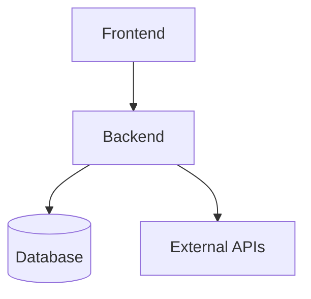

# Architecture

## System Overview

## Module Map

| Module | Purpose | Depth Rating |
|--------|---------|-------------|
| [module] | [purpose] | [deep/shallow] |

## Extension Points

| Point | How to Extend | Example |
|-------|---------------|---------|
| [Point] | [Method] | [Example] |

## Known Issues

| Issue | Location | Planned Fix |
|-------|----------|-------------|
| [Issue] | [File] | [Plan] |
